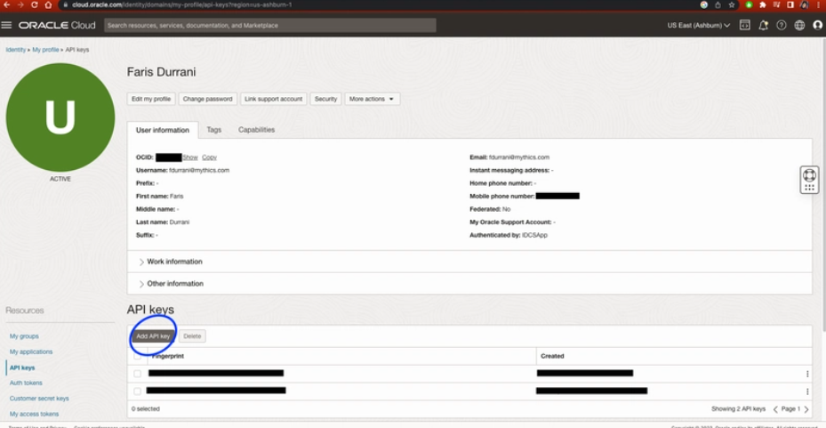
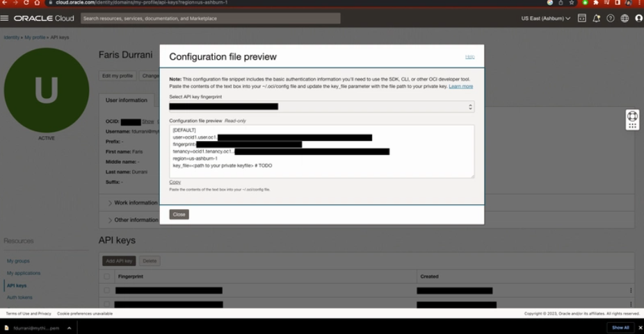

# OCI CLI Configuration

To manage OCI resources remotely with Terraform or Oracle CLI, you first need an OCI CLI configuration file that contains your user profile credentials.

OCI configuration file : a profile is a named set of configuration settings stored in your local OCI configuration file. It allows you to manage multiple OCI accounts, users, or environments from the same machine.

## Step 1: Set up the OCI configuration profile

1. Create the `~/.oci` directory.
	- This directory stores your OCI API credentials.

2. Create an API key in Oracle Cloud Console.
	- Go to: **Profile Picture > My Profile > API Keys > Add API Key**



	- Download the **private key** (downloading the public key is optional).
	- Click **Add**. A configuration file preview appears.



3. Put the API key details into your config file.
	- Copy the generated configuration content and paste it into `~/.oci/config`.
	- Create the file if it does not already exist.
	- `key_file` should point to the private key you downloaded (for example, a file stored in `~/.oci`).


user – OCID of the user making the API call
fingerprint – Fingerprint of the API key
key_file – Path to the private key file
tenancy – OCID of your tenancy
region – OCI region (e.g., us-ashburn-1)

## Terraform deployment (modular)

This folder provisions a complete OCI hub-and-spoke architecture:

### Infrastructure Components

- **Compartment**: Root-level compartment directly under tenancy root
- **Network**: Hub-and-spoke topology with DRG
  - 1 DMZ VCN (with Internet Gateway)
  - 2 Spoke VCNs
  - DRG with VCN attachments
  - Route tables with spoke↔DMZ and spoke↔spoke routing via DRG
  - Security lists with ingress/egress rules
  - 4 subnets (dmz-management, dmz-services, spoke-a-workload, spoke-b-workload)
- **Compute**: E2 instances across subnets
- **Bastion**: Bastion host VM in DMZ management subnet
- **State Storage**: Object Storage bucket for Terraform remote state (optional, enabled by default)

### Modules

- `modules/vcn`: wrapper around oracle-terraform-modules/vcn/oci (hub-spoke pattern)
- `modules/drg`: wrapper around oracle-terraform-modules/drg/oci
- `modules/compute`: reusable instance module
- `modules/object-storage-bucket`: OCI Object Storage bucket for state files

### Deployment Steps

From `oci-infra/`:

1. **Configure values** in `oci-infra-values.auto.tfvars`:
   - `tenancy_ocid`
   - `instances[*].image_ocid`
   - `instances[*].ssh_public_key_path`
   - Optionally set `state_bucket_name`

2. **Initialize Terraform** (first time):

```bash
terraform init
terraform plan
```

3. **Apply infrastructure**:

```bash
terraform apply
```

4. **Migrate to remote state** (after first apply):

After the Object Storage bucket is created, migrate your local state to remote backend:

```bash
# Get the backend init command from outputs
terraform output terraform_backend_init_command

# Run the command (replace <your-region> with your OCI region, e.g., us-ashburn-1)
terraform init -migrate-state -reconfigure \
  -backend-config="address=https://objectstorage.<your-region>.oraclecloud.com/n/<namespace>/b/<bucket>/o/oci-infra/state"
```

You'll need to set OCI authentication for the backend:
- `LOCK_ADDRESS`: same as `address` with `/lock` suffix
- `UNLOCK_ADDRESS`: same as `address` with `/unlock` suffix  
- Credentials: OCI CLI profile or environment variables

### Outputs

The configuration outputs:
- Compartment, VCN, subnet, DRG OCIDs
- Instance OCIDs
- Bastion host instance ID
- State bucket details and backend init command